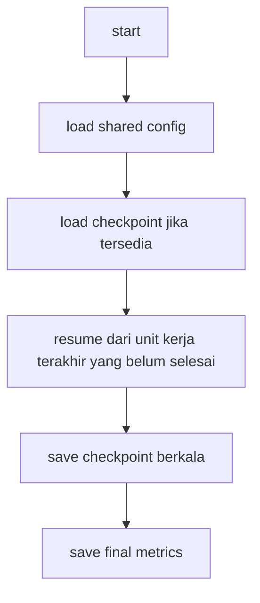

# Arsitektur Sistem — Pixel Watermark + Neural Codec

## Tujuan

Implementasi terbaru mengikuti requirement customer/dosen:

```mermaid
flowchart TD
	A["sabila"] --> B["48-bit binary payload"]
	B --> C["pixel-domain watermark embedding"]
	C --> D["watermarked frame/video"]
	D --> E["Neural Codec"]
	E --> F["reconstructed pixel"]
	F --> G["pixel-domain watermark extraction"]
	G --> H["48-bit payload"]
	H -- I["BER + Bit Accuracy + Detection"]
```

Watermark **tidak** ditanam pada latent Neural Codec. Neural Codec hanya digunakan untuk menguji ketahanan watermark yang sudah disisipkan pada domain pixel.

## Komponen penelitian

- Google Colab sebagai runtime.
- Google Drive sebagai shared dataset dan persistent workspace.
- Pixel-domain watermarking menggunakan payload `"sabila"` sepanjang 48 bit.
- Pseudo-random embedding pattern dan pixel correlation untuk extraction.
- Neural Codec `bmshj2018-hyperprior` sebagai satu-satunya codec penelitian.
- Evaluasi BER, Bit Accuracy, Detection Status, False Positive, dan PSNR bila digunakan sebagai metrik kualitas.

### Komponen yang tidak digunakan

Arsitektur ini tidak menggunakan:

- Neural Watermark Encoder / Embedder.
- Neural Watermark Extractor / Decoder.
- Latent watermark embedding.
- ECC repetition 3x sebagai bagian payload terbaru.
- H.264, H.265/HEVC, AV1, atau perbandingan antar-codec.
- Training model watermarking.

> Catatan: proses `compress()`/`decompress()` pada Neural Codec tetap diperlukan secara internal untuk menghasilkan reconstructed pixel. Proses tersebut bukan metode watermarking terpisah.

## Shared Google Drive

Semua runtime yang membutuhkan data atau hasil eksperimen menggunakan satu root directory yang dapat diakses oleh akun yang menjalankan Colab.

```text
MyDrive/
└── order_20260827_213103/
    ├── dataset/                 # dataset video asli; read-only selama eksperimen
    ├── output/                  # hasil final, CSV, grafik, report
    ├── watermarked/             # frame/video yang sudah diberi watermark
    ├── compressed/              # hasil Neural Codec
    ├── frames_tmp/              # artefak sementara; boleh dibersihkan/rebuild
    └── checkpoints/             # checkpoint model/state eksperimen
```

### Aturan sharing

1. Akun utama menyimpan folder `order_20260827_213103`.
2. Folder dibagikan ke akun Colab/anggota lain yang membutuhkan akses.
3. Pada akun penerima, gunakan shortcut folder shared ke root My Drive agar path stabil.
4. Notebook tidak mengandalkan lokasi lokal `/content` sebagai penyimpanan persisten.
5. Dataset dibaca dari shared Drive yang sama; tidak diunduh ulang ke sumber eksternal.

## Resource sharing dan persistence

Runtime Colab bersifat ephemeral. Karena itu:

- dataset persisten berada di shared Drive;
- hasil eksperimen persisten berada di `output/`;
- checkpoint persisten berada di `checkpoints/`;
- artefak sementara diarahkan ke `frames_tmp/` di Drive bila harus dapat dilanjutkan atau diaudit;
- direktori lokal hanya boleh dipakai untuk scratch yang tidak perlu dipertahankan.

Path harus didefinisikan dari satu `ROOT` sehingga seluruh cell menggunakan resource yang sama.

## Checkpoint system

Checkpoint digunakan pada proses yang mahal atau iteratif sehingga runtime dapat dilanjutkan tanpa mengulang seluruh pipeline.

Minimal checkpoint/state harus mencatat:

- nama eksperimen/run;
- tahap pipeline;
- index video/frame terakhir yang berhasil;
- konfigurasi payload dan embedding;
- konfigurasi Neural Codec;
- parameter eksperimen yang relevan;
- lokasi output;
- status selesai/gagal.

Checkpoint tidak boleh dianggap sebagai hasil eksperimen final. Hasil final tetap harus ditulis ke `output/` dalam bentuk CSV/JSON/grafik yang dapat diaudit.

### Prinsip resume



Jika checkpoint korup/tidak kompatibel, notebook harus gagal secara jelas atau memulai run baru dengan nama run berbeda; jangan diam-diam mencampur state lama dan baru.

## Pipeline penelitian

### 1. Payload

`"sabila"` dikonversi menjadi 48 bit berdasarkan representasi byte 8-bit per karakter.

### 2. Embedding

48 bit disisipkan langsung pada nilai pixel frame menggunakan mekanisme pixel-domain yang telah ditetapkan. Pattern/key yang sama harus tersedia pada extraction.

### 3. Neural Codec

Frame yang sudah diberi watermark menjadi input Neural Codec.

Bukti eksperimen harus dapat menunjukkan bahwa:

- input codec adalah watermarked frame;
- `compress()` benar-benar dipanggil;
- compressed/latent representation tersedia bila diekspos model;
- reconstructed frame dihasilkan melalui `decompress()`;
- BPP/ukuran representasi dapat dilaporkan jika tersedia.

### 4. Extraction

Watermark dibaca kembali langsung dari reconstructed pixel menggunakan lokasi/pattern yang sama. Tidak ada neural network yang membaca watermark.

### 5. Evaluation

Payload hasil extraction dibandingkan dengan payload asli:

- BER;
- Bit Accuracy;
- Detection Status;
- False Positive Test;
- PSNR/pixel difference untuk kualitas/invisibility bila digunakan.

## Auditability

Setiap run harus menyimpan artefak yang memungkinkan dosen/customer memverifikasi:

1. payload asli;
2. lokasi bit pada pixel;
3. nilai pixel sebelum embedding;
4. nilai pixel sesudah embedding;
5. perbedaan pixel;
6. bukti input watermarked masuk Neural Codec;
7. compressed representation/BPP jika tersedia;
8. reconstructed frame;
9. correlation dan bit hasil extraction;
10. payload hasil;
11. BER;
12. Bit Accuracy;
13. Detection Status;
14. False Positive;
15. PSNR bila dihitung.

Tidak boleh membuat klaim keberhasilan yang tidak didukung output run.
